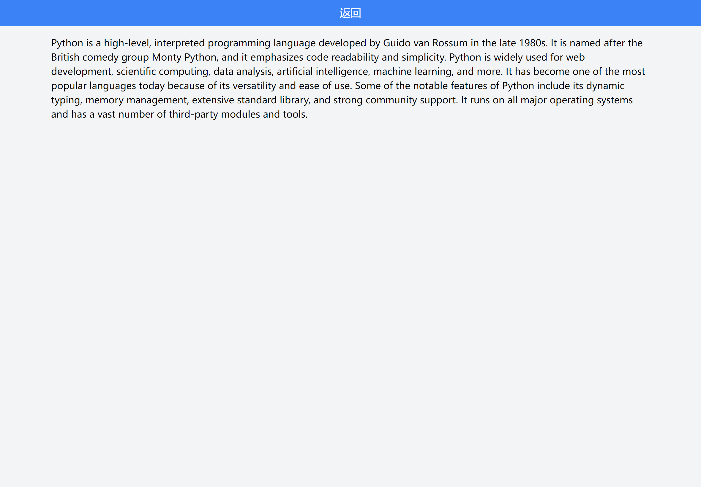

# Gpt-Turbo

基于 fastapi 的 gpt-3.5-turbo 项目, 来执行以下操作：

- 自然语言生成：可以生成高质量的自然语言文本，如文章、新闻、评论等。
- 语言翻译：可以进行多语言翻译，将一种语言的文本翻译成另一种语言。
- 问答系统：可以回答用户提出的问题，如常见问题、技术问题等。
- 语音识别：可以将语音转换成文本，方便进行文字处理和分析。
- 自动摘要：可以将一篇文章自动摘要，提取出文章的主要内容。
- 情感分析：可以分析文本中的情感倾向，判断文本的情感是积极、消极还是中性。
- 数据处理：可以处理结构化和非结构化数据，如表格、图表、文本等。

